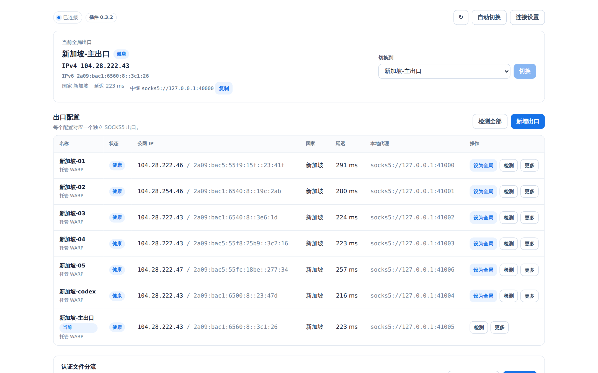
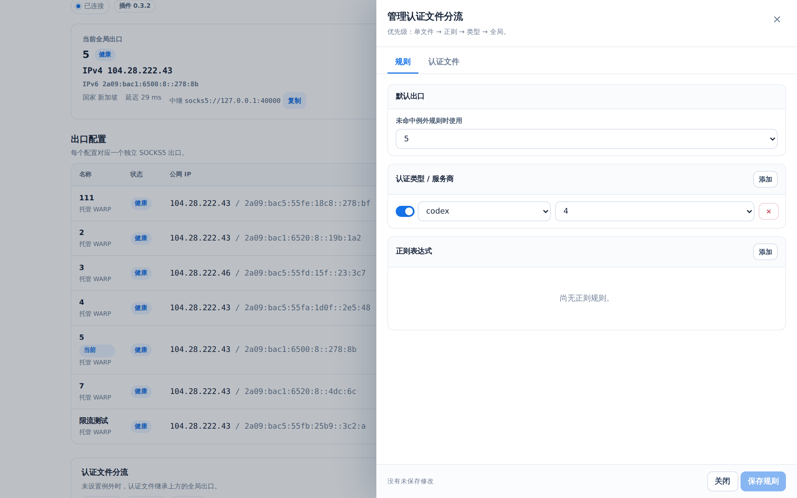
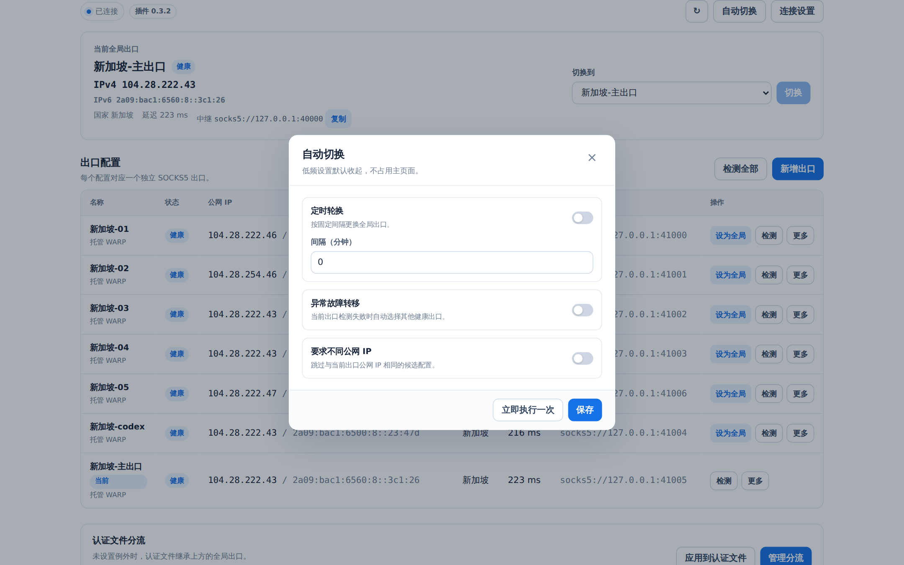
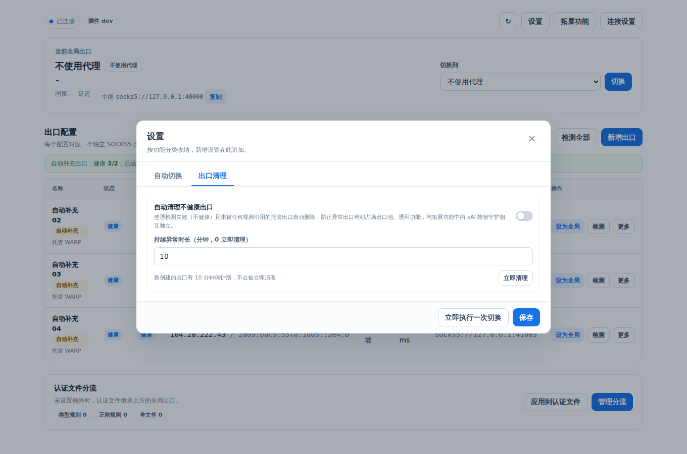
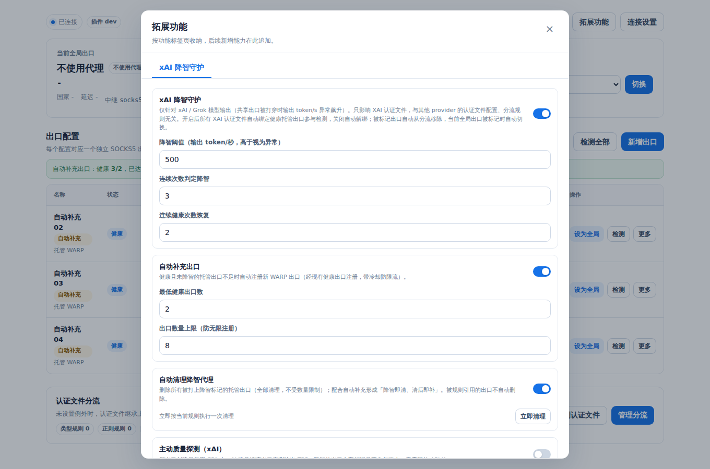

# CLIProxyAPI WARP Egress Plugin

为 [CLIProxyAPI](https://github.com/router-for-me/CLIProxyAPI) 提供可视化 WARP 出口管理、全局出口热切换与认证文件级代理分流。插件以动态库形式加载（`.so` / `.dll` / `.dylib`），`wgcf` 与 `wireproxy` 已内嵌，服务器零额外安装。

## 特性

| 能力 | 说明 |
| --- | --- |
| 管理面板 | 内置 Web UI：`/v0/resource/plugins/warp-egress/panel`（亮/暗主题跟随系统） |
| 托管 WARP 出口 | 面板内注册、启动、停止、重新注册、删除，独立 SOCKS5 端口 |
| 注册源导入 | 导入干净网络生成的 `wgcf-profile.conf`，完全规避注册限流 |
| 代理注册 | `register_via`：经已有出口或自定义 SOCKS5 发起注册，绕开本机 IP 限流 |
| 全局热切换 | 固定中继无重启切换；定时轮换、故障转移、不同 IP 约束 |
| 认证文件分流 | 单文件 / 正则 / 类型三级规则 + 全局兜底 |
| 单文件三态 | 继承全局 / 不设置代理 / 自定义代理（与 CPA 认证文件 `proxy_url` 字段联动） |
| 可选 xAI 出口守护扩展 | 默认关闭；开启后 xAI 按目标域名只走独立健康出口，thinking/TPS 交叉复测后自动切换 |
| 出口检测 | IPv4/IPv6、Colo、WARP 状态、延迟、重复 IP 标记 |
| 限流提示 | Cloudflare 429 注册限流的中文提示与处置建议 |

规则优先级：

```text
单个认证文件 > 正则表达式 > 认证类型/服务商 > 全局出口
```

## 工作方式

```text
CLIProxyAPI 全局 proxy-url
        │
        ▼
127.0.0.1:40000（插件固定 SOCKS5 中继）
        │
        ├── xAI 目标域名 ──> xAI 独立活动出口
        ├── 其他目标 + 普通全局出口已选择 ──> 普通全局出口
        └── 其他目标 + 普通全局出口关闭 ──> 服务器直连

认证文件 A proxy_url ──> WARP 配置 1 的独立 SOCKS5 端口
认证文件 B proxy_url ──> WARP 配置 2 的独立 SOCKS5 端口
认证文件 C 无 proxy_url ──> 继承 CLIProxyAPI 全局中继
认证文件 D "不设置代理" ──> 清除 proxy_url，跟随全局，不被其他规则接管
认证文件 E 自定义代理 ──> 使用 CPA 认证文件中已有的代理地址（与 CPA 面板联动）
```

普通全局切换和 xAI 独立出口切换都无需重启 CLIProxyAPI，两者状态互不覆盖。认证文件级规则通过 `host.auth.get` / `host.auth.save` 回调修改认证 JSON 的 `proxy_url` 字段——与 CPA 自带「认证文件代理」是同一个字段，两处完全同步。xAI 降智守护本身不会批量修改认证文件；未手工分流的 xAI 文件保持无 `proxy_url`，由本地中继按目标域名选出口。

## 界面预览











## 安装

支持两种安装路径：

| 方式 | 场景 |
| --- | --- |
| ① 插件商店一键安装 | 推荐；需要本插件已发布 Release 资产（见文末「维护者指南」） |
| ② 手动复制 | 离线/内网环境 |

### 方式 ①：插件商店安装

1. **添加商店源**：在 `config.yaml` 的 `plugins` 下追加：

   ```yaml
   plugins:
     enabled: true
     dir: "plugins"
     store-sources:
       - "https://raw.githubusercontent.com/imHansiy/warp-egress-plugin/master/registry.json"
   ```

   `store-sources` 追加到内置官方源（`CLIProxyAPI-Plugins-Store`）之后。重启生效。

2. **面板安装**：打开 `http://你的CLIProxyAPI地址:8317/management.html` →「插件商店」→ 找到 **WARP Egress** → 安装。CPA 自动完成：定位 zip → 下载 → `checksums.txt` 校验 SHA256 → 解压到 `plugins/` → 写入 `config.yaml` 启用。

### 方式 ②：手动复制

```bash
mkdir -p /path/to/CLIProxyAPI/plugins
cp bin/warp-egress.so /path/to/CLIProxyAPI/plugins/warp-egress.so
chmod 755 /path/to/CLIProxyAPI/plugins/warp-egress.so
```

或使用脚本：`./scripts/install-plugin.sh /path/to/CLIProxyAPI/plugins`。

## 配置 CLIProxyAPI

合并 `config.example.yaml` 到现有 `config.yaml`：

```yaml
proxy-url: "socks5://127.0.0.1:40000"

remote-management:
  allow-remote: false
  secret-key: "替换为高强度管理密钥"

plugins:
  enabled: true
  dir: "plugins"
  configs:
    warp-egress:
      enabled: true
      priority: 10
      data-dir: "./warp-egress-data"
      listen-host: "127.0.0.1"
      global-port: 40000
      profile-port-start: 41000
      profile-port-end: 41999
      auto-start: true
      health-check-interval: "60s"
      ip-check-url: "https://www.cloudflare.com/cdn-cgi/trace"
      allow-remote-listen: false
```

`wgcf-path` / `wireproxy-path` 可省略（使用内嵌版本）。`proxy-url` 必须与插件的 `listen-host + global-port` 一致；即使普通全局代理在插件面板里选择“不使用代理”，这个 CPA 配置也不能清空，否则请求会绕过插件，xAI 独立路由无法生效。

## 创建出口

### 方式一（推荐）：注册源导入

Cloudflare 注册接口按来源 IP 临时限流（429），数据中心/云环境 IP 极易触发。**在干净网络环境注册一次再导入，完全不触发限流**：

1. 在不受限流的机器（家宽、手机流量）上：

   ```bash
   ./wgcf register --accept-tos   # 生成 wgcf-account.toml
   ./wgcf generate                # 生成 wgcf-profile.conf
   ```

   也可用浏览器生成器（warpper.me、itsyebekhe.github.io/warp），下载的 `warp.conf` 即同一格式。

2. 通过管理 API 导入：

   ```bash
   CONF=$(cat wgcf-profile.conf)
   curl -X POST http://你的CLIProxyAPI地址:8317/v0/management/warp-egress/profiles/import \
     -H "Authorization: Bearer <remote-management.secret-key>" \
     -H "Content-Type: application/json" \
     -d "{\"name\":\"注册源导入的出口\",\"wgcf_profile\":\"$CONF\"}"
   ```

导入成功后自动分配独立 SOCKS5 端口并启动。

### 方式二：面板内直接注册

面板「新增配置」→「托管 WARP」，插件调用内嵌 wgcf 注册。若本机 IP 触发 429，可在「通过已有出口注册」选择一个已运行出口或自定义 `socks5://` 地址（API 参数 `register_via`），注册请求经该出口发出。

### 方式三：接入外部 SOCKS5

面板「新增配置」→「外部 SOCKS5」，填写 `socks5://` / `socks5h://` 地址（暂不支持带认证）。

## 面板使用

面板地址：`http://你的CLIProxyAPI地址:8317/v0/resource/plugins/warp-egress/panel`，输入管理密钥后使用（密钥仅存于当前标签页 `sessionStorage`）。

使用顺序：

1. 创建至少一个托管 WARP 出口（推荐注册源导入）。
2. 等待出口检测显示 `warp=on` 或 `warp=plus`。
3. 把一个出口设为全局出口。
4. 按需启用定时轮换或故障自动切换。
5. 添加类型规则（认证类型下拉选择）与正则规则（常用模板可选）。
6. 在认证文件表中为特殊账号选择单文件出口。
7. 在「路由规则」页点击「保存并应用」（保存与应用为两步，应用才写入认证文件）。

### 注册限流（429）

`api.cloudflareclient.com` 按来源 IP 临时限流（约 15 分钟窗口），共享出口（数据中心 IP、WARP 出口 IP）均可能触发；插件内置中文 429 提示。

| 规避方式 | 原理 | 备注 |
| --- | --- | --- |
| 注册源导入（推荐） | 干净网络注册后导入，不调用注册接口 | 见「创建出口 方式一」 |
| 通过已有出口注册 | 注册请求经所选出口发出 | WARP 出口 IP 同样可能被限流 |
| 等待窗口 | 429 为临时限流，15-30 分钟后重试 | 最被动 |

### xAI 降智守护

「拓展功能 → xAI 出口守护扩展」只改变 xAI / Grok 的出口质量维护逻辑，不接管其他 provider，也不改变手工认证文件分流功能：

- 这是默认关闭的可选扩展。关闭后不识别 xAI 目标、不主动探测、不维护独立出口，核心中继完全恢复普通全局代理行为。
- 核心中继只依赖通用目标路由扩展接口；xAI 域名与出口决策由自注册适配器实现，未来删除该扩展不会把 xAI 条件分支散回主中继。
- 默认使用 `independent` 模式：xAI 目标域名走独立活动出口；普通全局代理关闭时，非 xAI 直连，xAI 仍走代理。
- 独立模式没有健康出口时 xAI 连接 fail-closed，不会退回服务器直连或普通全局出口。
- 默认识别 `cli-chat-proxy.grok.com` 和 `api.x.ai`；自定义 `base_url` 必须把域名加入面板目标域名表。相同自定义网关域名若同时承载其他 provider，SOCKS 层无法按账号类型区分。
- xAI 认证文件保持无 `proxy_url`，守护不会扫描并批量写入；已有的单文件 `proxy_url` 优先级高于 CPA 全局配置，可能绕过本地中继。
- 真实 xAI 请求按实际活动出口统计输出 TPS；`output_tokens` / `completion_tokens` 已含推理 Token，不与 `reasoning_tokens` 重复相加，只有 reasoning 明细时仍保留为最小输出证据。
- TPS 分为软阈值与硬阈值：默认 `soft_tps=500` 连续 3 次后交叉复测，`hard_tps=1000` 单次命中立即隔离；缺 thinking 独立累计。
- 主动探测中能够归因到出口的错误默认连续 3 次后隔离；账号过期、额度耗尽、401/403/429 和暂无可调度账号只记录诊断，不消耗出口错误次数。
- 隔离前检查 `min_healthy`：如果隔离后健康出口会低于下限，则标记 `suppressed` 并保留路由，避免所有 xAI 出口同时退出活动池。
- 被动 thinking/软 TPS 异常达到阈值后默认主动交叉复测同一出口；同一出口最多一个复测任务，避免请求高峰形成 Token 消耗风暴。
- 主动探测每轮只检查一个最久未测的出口，并保证同一时刻最多一个探测请求；筛出的少量探针账号在内存复用 5 分钟，避免每个出口都重新拉取数千账号。
- 探针账号只从 CPA 当前未禁用、未标记不可用、未处于冷却期的 xAI 账号中选取；401/403、免费额度耗尽和 429 会换下一个账号，不会误判为出口降智。
- 探测超时、EOF、连接重置或 TLS/HTTP2 流中断属于出口不稳定，立即退出 xAI 活动池，不通过换账号掩盖。
- xAI 活动出口降智时，近期实测健康的备用出口可直接接管；结论过期的候选先探测，确认健康后只更新 xAI 活动出口，不改普通 `GlobalProfileID`。
- 主动探测的同一出口最短复检间隔默认 15 分钟，可在面板调整。

手工给某个 xAI 认证文件设置独立出口仍然有效，但不属于降智守护的自动行为。

thinking 字段识别、账号额度与出口故障分离、交叉验证的设计参考了 MIT 许可的 [grok2api-egress-enhancements](https://github.com/lij768423-svg/grok2api-egress-enhancements)，并按本插件“不批量绑定认证文件、xAI 独立活动出口”的架构重新实现。

### 认证文件分流

单文件出口选项：

| 选项 | 行为 |
| --- | --- |
| 继承全局 | 清除单文件锁定，按优先级回落（可能被类型/正则规则接管） |
| 不设置代理 | 清除该文件 `proxy_url`，锁定不被其他规则接管，跟随全局 |
| 自定义代理 | 显示并复用 CPA 认证文件中已有的代理地址（与 CPA 面板实时同步） |
| 具体出口 | 绑定到指定 WARP / 外部 SOCKS5 出口 |

正则规则可匹配字段：`name`、`email`、`label`、`provider`、`type`、`all`（合并匹配）。

```text
目标：email
表达式：@example\.com$
出口：warp-singapore-02
```

## 管理 API

```text
GET  /v0/management/warp-egress/status
GET  /v0/management/warp-egress/profiles
POST /v0/management/warp-egress/profiles/create
POST /v0/management/warp-egress/profiles/import
POST /v0/management/warp-egress/profiles/action
POST /v0/management/warp-egress/profiles/delete
POST /v0/management/warp-egress/global/switch
GET  /v0/management/warp-egress/auth-files
POST /v0/management/warp-egress/auth-files/assign
GET  /v0/management/warp-egress/rules
POST /v0/management/warp-egress/rules/save
POST /v0/management/warp-egress/rules/apply
GET  /v0/management/warp-egress/auto
POST /v0/management/warp-egress/auto/save
POST /v0/management/warp-egress/auto/run
```

认证方式：`Authorization: Bearer <remote-management.secret-key>`

关键参数：

- `POST /profiles/create`：托管模式可传 `register_via`（托管出口 ID 或 `socks5://` 地址）。
- `POST /profiles/import`：`{name, wgcf_profile}`，导入 wgcf-profile.conf 内容，不触发注册。
- `POST /auth-files/assign`：`{auth_index, profile_id | proxy_url, apply_now}`。`profile_id` 为空清除出口；`direct` 表示不设置代理（锁定清除）；`proxy_url` 字段写入任意自定义代理。

## 数据目录

```text
warp-egress-data/
├── state.json
└── profiles/
    └── warp-xxxxxxxxxxxx/
        ├── wgcf-account.toml
        ├── wgcf-profile.conf
        ├── wireproxy.conf
        └── wireproxy.log
```

注册资料包含私钥：目录权限默认 `0700`，状态与配置文件默认 `0600`。不要提交到 Git。

## 限制与安全

限制：

- WARP 配置数量不等于唯一出口 IP 数量：免费版 IPv4 出口全局共享（如 `104.28.222.43`），区分出口以 IPv6 为准。
- 重新注册配置后出口可能变化，也可能不变。
- 单文件分流仅适用于有物理 `.json` 文件的认证；运行时虚拟认证会被跳过。
- 主 YAML 中的静态 API Key 无独立认证文件，只能使用全局中继。
- 外部出口仅支持无认证的 `socks5://` / `socks5h://`。
- 插件不会按请求重新注册 WARP，避免中断流式请求与高频创建设备。
- 尚未在所有 CLIProxyAPI 发行版与架构上做集成测试；首次部署请先备份认证目录。

安全建议：

- 保持 `listen-host: 127.0.0.1`，不要对外开放 `40000` 与 `41000-41999` 端口。
- 保持 `remote-management.allow-remote: false`，或在反向代理层增加额外认证。
- 先备份 CLIProxyAPI 的 `auth-dir`，再首次执行「保存并应用」。
- 使用系统服务管理 CLIProxyAPI，避免插件被强制终止时留下不完整操作。

---

# 维护者指南

以下内容面向插件维护者（发布流程与构建），最终用户无需阅读。

## 插件商店发布流程

商店安装依赖 GitHub Release 上的 `<插件ID>_<版本>_<平台>_<架构>.zip` + `checksums.txt`，打标签后 CI 自动构建全部平台并发布。每次发版：

1. **同步 registry 版本号**：三份 `registry*.json` 的 `version` 更新为目标版本，并更新 `CHANGELOG.md`，执行 `make registry-check` 校验后提交推送。

2. **打标签发布**（`vX.Y.Z` 替换为目标版本，如 `v0.3.0`）：

   ```bash
   git tag vX.Y.Z && git push origin vX.Y.Z
   ```

   CI（Release 工作流）自动：在 glibc 2.31（bullseye）容器内构建 linux/amd64、linux/arm64、windows/amd64 → 打包 zip → 生成 `checksums.txt` → 上传 Release 资产。商店用户即可搜索安装该版本。

## 平台支持

| 平台 | 架构 | 插件文件 | 构建方式 |
| --- | --- | --- | --- |
| Linux | amd64 / arm64 | `warp-egress.so` | 交叉编译（arm64 需 `gcc-aarch64-linux-gnu`） |
| Windows | amd64 | `warp-egress.dll` | 交叉编译（需 mingw-w64） |
| macOS | amd64 / arm64 | `warp-egress.dylib` | 原生构建（macOS 主机，系统 clang） |

`.so` / `.dll` / `.dylib` 均为原生动态库，须与 CPA 进程同架构、同 libc（Linux 用 bullseye 容器保证 glibc 2.31 可加载）。`wgcf` / `wireproxy` 按构建平台自动下载对应版本内嵌，无需手工准备。

## 本地构建

```bash
make test
make build-linux-amd64                        # Linux x86-64
make build-linux-arm64                        # Linux arm64（需 gcc-aarch64-linux-gnu）
make build-windows-amd64                      # Windows x86-64（需 mingw-w64）
make build-darwin-amd64 / build-darwin-arm64  # macOS（需在 macOS 主机上构建）
```

发布打包：`make release`（输出 `dist/<plugin>_<version>_<goos>_<goarch>.zip` + `checksums.txt`），另提供 `release-windows-amd64`、`release-darwin-amd64`、`release-darwin-arm64`。

## Registry 文件

仓库提供三份 Plugin Store schema v1 文件（`registry.json` 双语、`registry.zh-CN.json`、`registry.en.json`）。发布前将三份文件中的 `https://github.com/OWNER/warp-egress` 替换为真实仓库地址并执行：

```bash
make registry-check
```

详见 `REGISTRY.md`。
